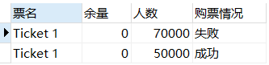
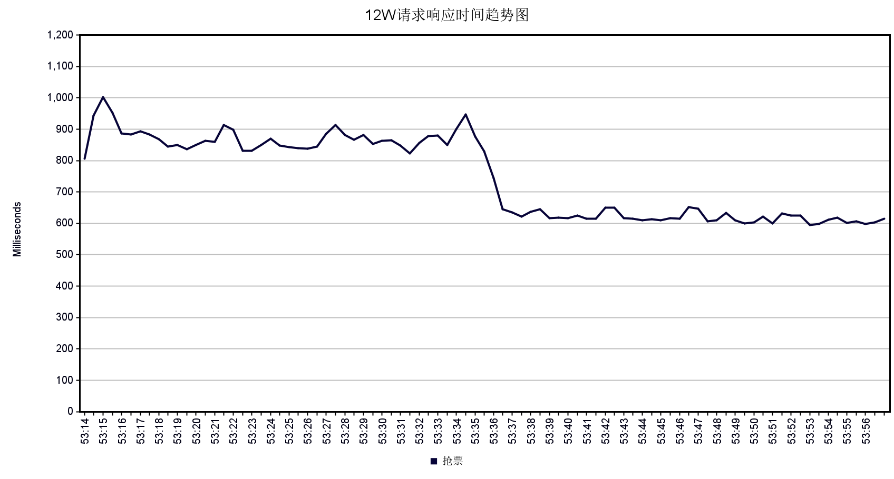
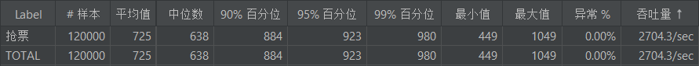
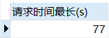
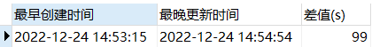

# fast-tickets

高并发的单机部署抢票系统，使用 SpringBoot、消息队列、Redis以及Mysql作为主要支撑，实现每分钟 12W 的并发请求。

## 一、设计思路

抢票的流程主要是，用户发起请求，服务端判断是否有足够的余量，如果有则发给用户并从数据库中减少一张票。这在低并发的情况下是没有什么问题的，但是在高并发下，对数据库的删减可能会出现数据的重复刷写以及读写性能缓慢的问题等，我们的优化主要有以下几个方向：

1. 将库存提前缓存在 redis 数据库中，用户请求时直接对缓存数据库进行预扣减，因为其存储在内存中，因此处理速度很快。
2. 设置消息队列，将用户抢票的数据库操作存放在队列中，让消费者依次消费数据，可以达到削峰的作用。
3. 消费者一次性消费多个数据库操作请求，将其合并为一次数据库读写，可以大幅度提高性能。因为 mysql 数据库存储在磁盘上，多次更新的性能缓慢，如果合并为一次更新，可以节省时间。
4. 如果一个票种的余量已经没有了，就将此信息直接缓存在内存中，到来的请求不用再去 redis 中查询库存。

具体的请求处理步骤如下：

1. 判断内存标记，该票是否还有库存，如果没有直接返回。
2. 检查 redis 预先扣减库存。如果没有库存直接返回。
3. 将数据库操作发送给消息队列，返回给用户抢票的订单 id。
4. 消息队列一次接受多个请求，合并数据库操作，更新用户抢票信息。

## 二、实验分析

### 2.1 实验环境

Windows11 22H2 32GB内存 Intel i5-10400F@2.9GHz
Ubuntu 1804 4GB内存
性能测试工具 jmeter

### 2.2 快速部署

1. docker 容器中部署 mysql 和 redis

```shell
# mysql:5.7
docker pull mysql:5.7
docker run -p 3306:3306 -e MYSQL_ROOT_PASSWORD=root --name fast_tickets_mysql -d mysql:5.7
# redis:latest
docker pull redis
docker run -p 6379:6379 --name fast_tickets_redis -d redis
```

2. 部署 rocketmq 的 nameserver

```shell
# rocketmq:4.4.0
docker pull rocketmqinc/rocketmq:4.4.0
mkdir /root/mq
docker run -d -p 9876:9876 -v /root/mq/data/namesrv/logs:/root/logs -v /root/mq/data/namesrv/store:/root/store --name rmqnamesrv -e "MAX_POSSIBLE_HEAP=100000000" rocketmqinc/rocketmq:4.4.0 sh mqnamesrv
```

3. 配置 broker

```shell
vim /root/mq/conf/broker.conf
# 文件内容
brokerClusterName = DefaultCluster
brokerName = broker-a
brokerId = 0
deleteWhen = 04
fileReservedTime = 48
brokerRole = ASYNC_MASTER
flushDiskType = ASYNC_FLUSH
brokerIP1 = 192.168.45.128
```

4. 部署 broker

```shell
docker run -d -p 10911:10911 -p 10909:10909 -v /root/mq/data/broker/logs:/root/logs -v /root/mq/rocketmq/data/broker/store:/root/store -v /root/mq/conf/broker.conf:/opt/rocketmq-4.4.0/conf/broker.conf --name rmqbroker --link rmqnamesrv:namesrv -e "NAMESRV_ADDR=namesrv:9876" -e "MAX_POSSIBLE_HEAP=200000000" rocketmqinc/rocketmq:4.4.0 sh mqbroker -c /opt/rocketmq-4.4.0/conf/broker.conf
```

5. 部署r ocketmq 控制台

```shell
# rocketmq-console-ng
docker pull styletang/rocketmq-console-ng
docker run -d -e "JAVA_OPTS=-Drocketmq.namesrv.addr=192.168.45.128:9876 -Dcom.rocketmq.sendMessageWithVIPChannel=false" -p 8080:8080 -t styletang/rocketmq-console-ng
```

[6]. 使用 jmeter 压测

```shell
jmeter -n -t ./jmeter/fast_tickets.jmx -l ./jmeter/result.csv -e -o ./jmeter/httpReports
```

### 2.3 结果分析

> 我们模拟了 1min 内有 12 万用户的抢票事件，为了方便模拟，我们假设所有用户抢购的都是同一种票，并且该票总共有 5 万的余量。

实验结果证明了以下的几点：

1. **不存在超售、多售、不售的情况**。使用如下的 SQL 语句查询用户的订购记录表，其中当前票的余量为 0 证明所有票都卖出，并且有 5 万人抢票成功，7 万人抢票失败，与一开始只有 5 万张余票的信息相符合。

```sql
SELECT i.name `票名`, i.stock `余量`, COUNT(l.id) `人数`, 
(CASE WHEN l.`status` = 0 THEN "失败" ELSE "成功" END) AS `购票情况`
FROM `logs` l, inventory i 
WHERE l.goods_id = i.id 
GROUP BY l.goods_id, l.`status`
```



2. **在每个用户可接受的时间内响应**。用户发出抢票请求后，应该及时响应每一个人的请求，无论是否抢票成功，都应告知用户目前的抢票状态。如下图所示，系统的最差响应延迟也在 1000ms 以内，并且平均响应时间在 700ms 左右。





3. **在每个用户可接受的时间内告知抢票结果**。使用如下的 SQL 语句查询用户自从发出请求后多久可以确定抢票结果，可以看出用户至少可以在 77s 内获取抢票结果。并且系统在 99s 内完成了所有请求的接受和数据库处理并返回结果。

```sql
SELECT MAX(TIMESTAMPDIFF(SECOND,create_time, update_time)) `请求时间最长(s)`
FROM `logs`
```



```sql
SELECT MIN(create_time) `最早创建时间`, MAX(update_time) `最晚更新时间`, TIMESTAMPDIFF(SECOND,MIN(create_time), MAX(update_time)) `差值(s)`
FROM `logs`
```


